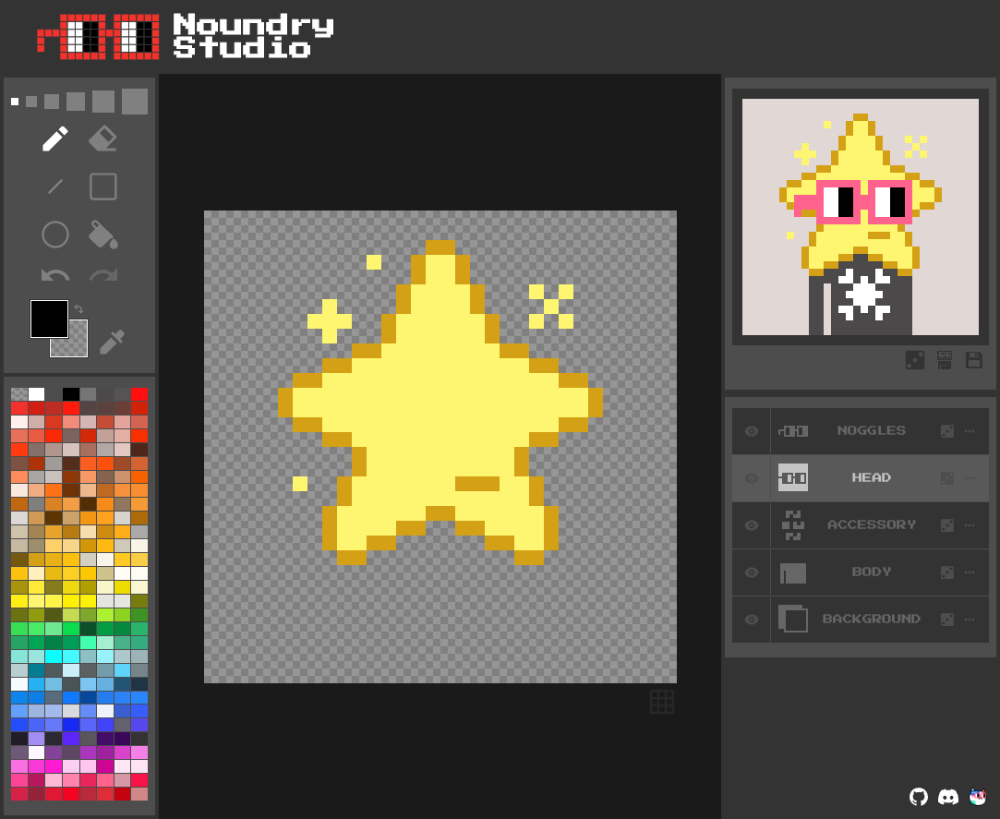

# Noundry Studio ⌐◧-◧
[](https://www.gitpoap.io/gh/volkyeth/noundry-studio)

Noundry studio is a pixel editor optimized for the workflow of designing new Nouns parts/traits and trying them out with existing ones.



## Running locally

This project runs on https://vitejs.dev

```bash
yarn
yarn dev
```

## Contributing

Bug reports are welcome.

Feature Requests are welcome.

Pull requests are more than welcome. If it's a big change, please open an issue first to discuss it.

**Contributors are eligible for a [GitPOAP](https://www.gitpoap.io/gh/volkyeth/noundry-studio). Get yours now!**


## Author


I'm Volky, a web3 engineer developing for the Nouns ecosystem. 

## Acknowledgements

This project was funded (twice 🙏) on https://prop.house by the [Nouns](https://nouns.wtf) community. Thank you!

## License

CC0

Attribution is appreciated but not required.

Fork if you must, but please contribute back to the upstream if you can, so we can all benefit from it ✌.
